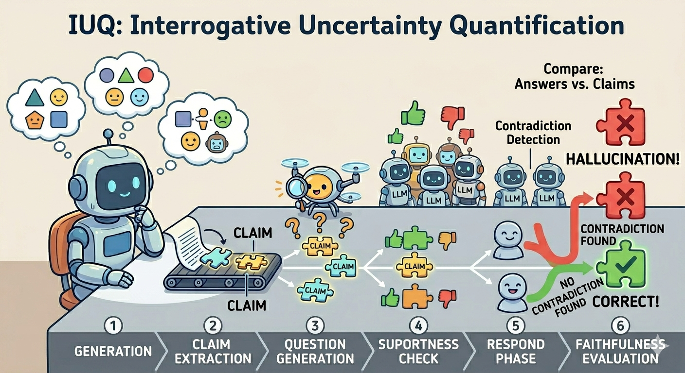

# IUQ: Interrogative Uncertainty Quantification for Long-Form Large Language Model Generation [ACL 2026]

This repo is the implementation of **IUQ: Interrogative Uncertainty Quantification for Long-Form Large Language Model Generation**.

IUQ quantifies uncertainty in long-form Large-Language-Model generation by interrogating the model with targeted independent questions. The final claim-level uncertainty score is a combination of cross-sample consistency and the model's faithfulness to the generative context.


<sub>[The above image is generated by Google Gemini for illustrative purpose]</sub>

---

## Setup

Dependencies are specified in requirements.txt.

```bash
pip install -r requirements.txt
```

Set your API keys in `credentials.py`:

```python
openai_api_key   = "sk-..."
together_api_key = "tgp_..."
```

Both keys may be needed at once: even when evaluating an open-source model via TogetherAI, `batch_main.py` calls an OpenAI judge model for correctness evaluation. 
You may need to get the corresponding api keys from [together.ai](https://api.together.ai/) and [OpenAI](https://platform.openai.com/) first. Evaluating locally deployed model is not supported at this moment.

IUQ uses [FActScore](https://github.com/shmsw25/factscore) and [LongFact](https://github.com/google-deepmind/long-form-factuality) for evaluation, which are both pre-loaded in the [dataset](./dataset) directory.
Simply change the seed or set the number of samples to load in [`config.yaml`](./config.yaml). Please configure [`config.yaml`](./config.yaml) before running any pipeline.

---

## Pipeline Overview

The pipeline implements the following conceptual stages:

1. **Generation** — sampling N completions (e.g. with temperature=1.0 and top-p=1.0) of the input prompt
2. **Claim Extraction** — break the long-form generation into atomic claims
3. **evaluation** — evaluate the correctness of each claim using ground-truth reference text
4. **Question Generation** — generate targeted interrogation question(s) for each claim
5. **Respond** — generate M independent answers per interrogation question
6. **Faithfulness** — derive contradiction score between each answer and the accumulated claim context

The entry point for the pipeline can be:
* **batch_main.py**: make use of the batched request provided by the inference provider to save money (usually half price) and time; this is also the main entry point to comprehensively evaluate a model.
* **main.py**: designed for a single prompt (e.g. tell me a short bio of Leonardo da Vinci) and does not evaluate the correctness of extracted claims due to the absence of reference sources.

---

## `batch_main.py` — Batched Pipeline

Designed for **full dataset evaluation** ([FActScore](https://github.com/shmsw25/factscore) and [LongFact](https://github.com/google-deepmind/long-form-factuality)). Instead of blocking on each call, it packages all requests for a phase into a JSONL file, submits them to the provider's batch API, and exits. You run batch_main.py with `--next` flag to start and proceed through each phase.

**Workflow:**

```bash
python batch_main.py --status          # inspect current phase statuses
python batch_main.py --next            # submit next pending phase, poll for completion status, or process a completed batch
# … wait for the batch to finish, then run --next again
```

Each `--next` call either submits a new batch (if the phase is `pending`) or downloads and processes results (if the batch is `completed`). The command is idempotent and safe to re-run.

Note that the `interrogation` phase submits **three batches simultaneously**: question generation, supportness evaluation, and correctness evaluation (the correctness batch always uses the OpenAI judge regardless of the main model's provider).

**Output** under `--result-dir` (organized by provider org / model name):

```
results_batch/
└── meta-llama/
    ├── Llama-3.3-70B-Instruct-Turbo_factscore_pipeline.json      # manifest with batch IDs and token counts
    ├── Llama-3.3-70B-Instruct-Turbo_factscore_generations.*      # json exported results of LLM generations
    └── Llama-3.3-70B-Instruct-Turbo_factscore_analysis_results.* # json exported analysis results
```

Example manifest after a completed run:

```json
{
  "phases": {
    "generate":              { "status": "completed", "batch_id": ["3cf03d14-..."], "total_tokens": 9155 },
    "claim_extraction":      { "status": "completed", "batch_id": ["db6844a9-..."], "total_tokens": 16427 },
    "interrogation":         { "status": "completed", "batch_id": ["1334c569-...", "848ee62c-...", "batch_69dc3d92..."], "total_tokens": [12311, 37281, 18899] }
    "respond":               { "status": "completed", "batch_id": ["01e6db5f-..."], "total_tokens": 167330 },
    "faithfulness_evaluation":{ "status": "completed", "batch_id": ["65f110b6-..."], "total_tokens": 443216 }
  }
}
```

Please run 
```bash
python plot.py
```
to automatically detect and report the performance metrics of IUQ on specific models. 

---

## `main.py` — Synchronous Pipeline

Designed for **a single prompt**. Each API call is blocking and sequential (can be unexpectedly slow for certain models); all six phases run in one process. No dataset is required. Correctness evaluation (which requires the reference knowledge database) is skipped.

Each phase is checkpointed to disk, so an interrupted run resumes from where it left off.

```bash
python main.py \
  --prompt "Tell me about the life of Marie Curie" \
  --model "meta-llama/Llama-3.3-70B-Instruct-Turbo"
```

**Output** under `--result-dir`:

```
results_synchronous/
├── <topic>_manifest.json       # phase completion flags
├── <topic>_generations.json    # Phase 1 output
├── <topic>_analysis.json       # accumulated TopicResult (updated after each phase)
└── <topic>_results.json        # final output with UQ scores
```

---

## Token Usage Estimates

Based on a reference run: **5 topics, 5 generations/topic, 1 question/claim, 3 answers/question**, using `Llama-3.3-70B-Instruct-Turbo` on FActScore (~92 claims/topic on average).

| Phase | Total tokens (5 topics) | Per topic | Notes |
|-------|------------------------|-----------|-------|
| Generation | 9,155 | ~1,800 | Small — just the prompt + completions |
| Claim Extraction | 16,427 | ~3,300 | Structured output; scales with generation length |
| Question Generation | 58,125 | ~11,600 | Scales with claim count |
| Supportness | 849,556 | ~170,000 | **Dominant.** Each claim is checked against all N generations → O(claims × N²) |
| Respond | 167,330 | ~33,500 | Scales with claims × answers per question |
| Faithfulness | 443,216 | ~88,600 | Each answer re-read with accumulated claim context |
| **Total** | **~1,544K** | **~309K** | Correctness eval excluded |

The **supportness phase accounts for ~55% of total token cost** because every claim in every generation is checked against all N diverse generations independently. Reducing `num_gen_samples` has a roughly quadratic effect on this phase.

The **faithfulness phase** is the second largest cost driver: it grows with `num_gen_samples × claims_per_gen × num_ans_per_question`, and each request carries an expanding claim-context window.

---

## Repository Structure

```
├── main.py                    # Synchronous single-prompt pipeline
├── batch_main.py              # Asynchronous batch pipeline
├── config.yaml                # Shared configuration
├── credentials.py             # API keys
├── schemas.py                 # Pydantic models: Claim, GenerationSample, TopicResult
├── prompts.py                 # LLM prompt templates
├── compute_uncertainty.py     # Standalone UQ score computation
├── plot.py                    # Visualization utilities
├── utils/api.py               # Synchronous chat_completion (OpenAI / TogetherAI)
├── batch_utils/
│   ├── api.py                 # Batch API clients + BatchRequestCollector
│   ├── generation_phase.py
│   ├── interrogation_phase.py
│   ├── respond_phase.py       # RespondPhase + FaithfulnessEvaluationPhase
│   └── utils.py               # CacheFileManager (shelve-backed)
└── dataset/
    ├── parse_factscore.py
    └── parse_longfact.py
```

---

## Citation

If you find our paper or code helpful, please consider citing:

```bibtex
@inproceedings{fan2026iuq,
  title     = {IUQ: Interrogative Uncertainty Quantification for Long-Form Large Language Model Generation},
  author    = {<Author 1> and <Author 2> and <Author 3>},
  booktitle = {Proceedings of the 64th Annual Meeting of the Association for Computational Linguistics (ACL)},
  year      = {2026}
}
